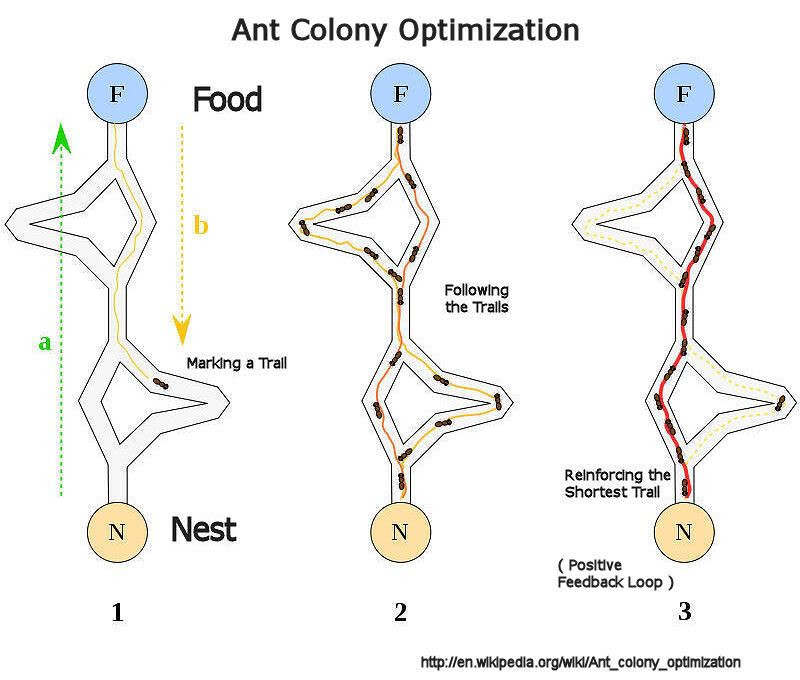

# TheAntsProject

## Evolutionary algorithms

Evolutionary algorithms are designed so as to mimic certain behaviours. Such algorithmic design is not only constrained to humans but can be inspired by the natural behaviour of certain animals as well.

## Ants colonies

Although ants have limited cognitive abilities individually, they are able to find the **shortest path** between a food source and their nest **collectively**.

Ants communicate with each other using sound, touch and pheromone. **Pheromones** are organic chemical compounds secreted by the ants that trigger a social response in members of same species. Since most ants live on the ground, they use the soil surface to leave pheromone trails that may be followed (smelled) by other ants.

When looking for food, ants initially explore the area surrounding their nest in a random way. If an ant finds a food source, it evaluates it and returns some food to the nest. During the return journey, the ant deposits a pheromone trail on the path followed. The deposited pheromone depends on the quantity and quality of the food, and this guides other ants to this food source.

To prevent the colony from getting stuck on a suboptimal path forever, the pheromone slowly evaporates over time. This allows old, less-used paths to fade away, giving the ants a chance to explore new, potentially better routes.

## Path optimization

Initially, ants start to move randomly in search of food around their nests. This randomized search opens up multiple routes from the nest to the food source. The probability of selection of a specific path is based on the concentration as well as the rate of evaporation of pheromone.

There exists multiple stages:

1. All ants are in their nest. There is no pheromone content in the environment.
2. Ants begin their search with equal (0.5 each) probability along each path. Initially, ants wander randomly. Some will happen to take shorter paths, and some will take longer paths.
3. The ants through the shorter path reaches food source earlier. The ants that take a shorter path will complete the round trip (nest -> food -> nest) faster. This means they will make more trips in the same amount of time, reinforcing theyr shorter path with pheromone. Due to pheromone trail along the shorter path already available, probability of selection is higher. When an ant comes to a fork in the road, it is more likely to choose the path that has a stronger pheromone scent.
4. More ants return via the shorter path and subsequently the pheromone concentrations also increase. The more ants that follow a trail, the stronger the pheromone trail becomes. Moreover, due to evaporation, the pheromone concentration in the longer path reduces, decreasing the probability of selection of this path in further stages. Therefore, the whole colony gradually uses the shorter path in higher probabilities. So, path optimization is attained.

## Pheromone updates
